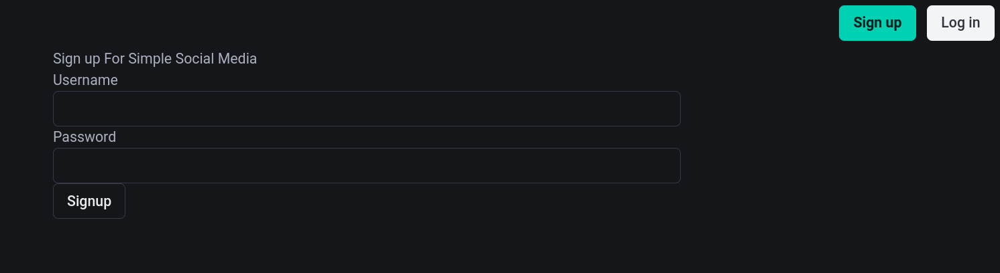
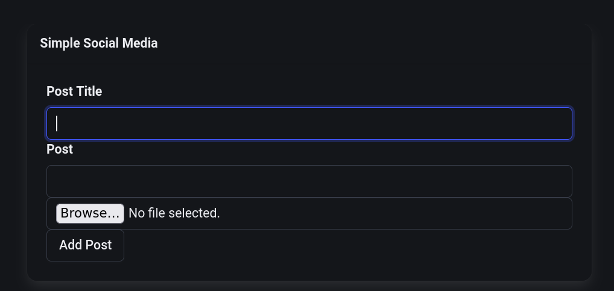
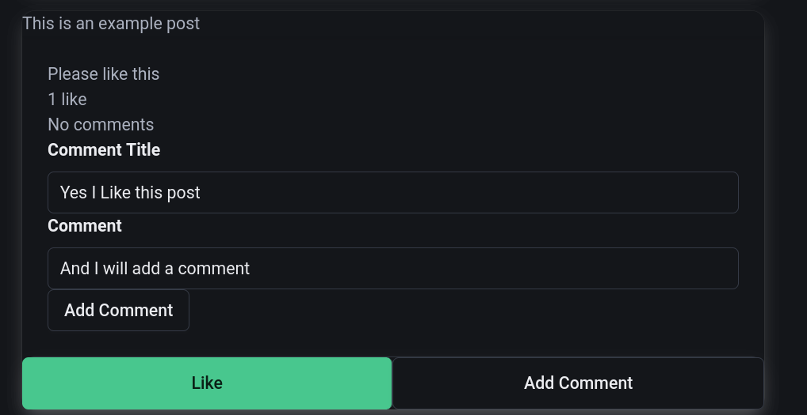

# Simple Social Media

This is a project I did for my YouTube channel CSPythonForScience. It entails using
FastAPI and HTMX to create a simple social media site that users can log into,
add post, like posts, and make comments on. It demonstrates how to seamlessly
integrate SQLite, FastAPI, Jinja2 templates, and HTMX to generate a responsive
web application in a full stack manner.

## Features

Users can create an account and log in to the site with a JWT session cookie.

Once users sign up and login they can upload posts

Log in users will also have the ability to add a like and comment

## Playlist

For a full walk through, the playlist is located [here](https://www.youtube.com/playlist?list=PLgW_6frmN8XyGfMiA6Oc2pmHzDjEbD55T). Feel free to adapt this code for your own use case.

### License

Copyright 2024 CSPythonForScience

Permission is hereby granted, free of charge, to any person obtaining a copy of this software and associated documentation files (the “Software”), to deal in the Software without restriction, including without limitation the rights to use, copy, modify, merge, publish, distribute, sublicense, and/or sell copies of the Software, and to permit persons to whom the Software is furnished to do so, subject to the following conditions:

The above copyright notice and this permission notice shall be included in all copies or substantial portions of the Software.

THE SOFTWARE IS PROVIDED “AS IS”, WITHOUT WARRANTY OF ANY KIND, EXPRESS OR IMPLIED, INCLUDING BUT NOT LIMITED TO THE WARRANTIES OF MERCHANTABILITY, FITNESS FOR A PARTICULAR PURPOSE AND NONINFRINGEMENT. IN NO EVENT SHALL THE AUTHORS OR COPYRIGHT HOLDERS BE LIABLE FOR ANY CLAIM, DAMAGES OR OTHER LIABILITY, WHETHER IN AN ACTION OF CONTRACT, TORT OR OTHERWISE, ARISING FROM, OUT OF OR IN CONNECTION WITH THE SOFTWARE OR THE USE OR OTHER DEALINGS IN THE SOFTWARE.
